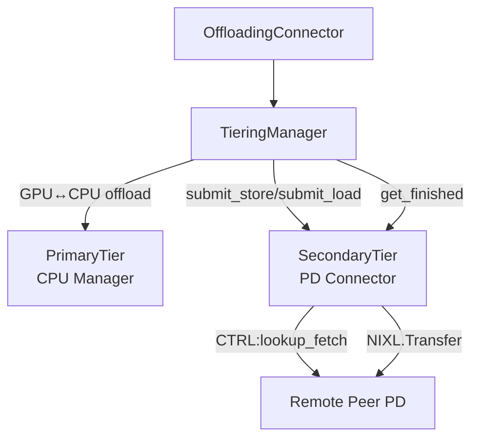
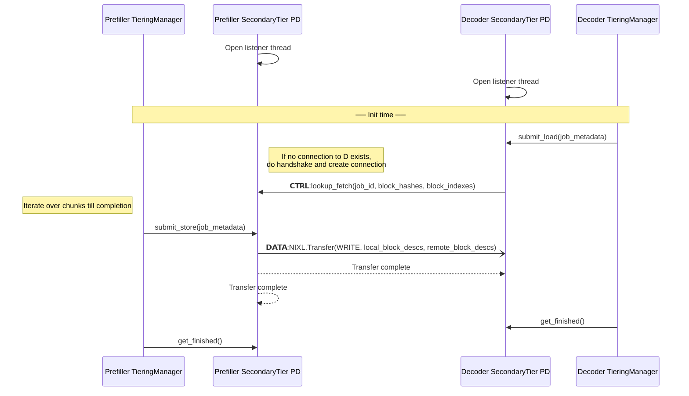

# PD Connector Design Document

## Abstract

In this design PD disaggregation is based on the vLLM CPU KV cache which is per vLLM instance and it is in canonical layout (single TP unified block size). The PD Connector is a secondary tier that implements the `SecondaryTierManager` interface. Orchestration between the primary tier (CPU Manager) and secondary tiers is done by the `TieringManager`, which is transparent to the secondary tiers.

## Assumptions

- Decoder can be known or unknown to Prefiller when a request is submitted to the Prefiller (Deffered decode)
- A request can be submitted to the Decoder without any dependency on submitting the request to the prefiller
- Translating canonical layout to per GPU worker layout is done in the worker context (Secondary tiers are agnostic to that)
- A store operation to the CPU KV cache can fail only by:
  - Allocation failure
  - Prefiller crash

## Requirements

- Each Prefill node can service pull requests from any other node in the cluster
- Crash of Prefiller or Decoder should be handled gracefully without any resource leaks
- Support general P2P sharing pro-active and reactive
- Security?
- Different block size across nodes in the cluster?
- Performance of TTFT and Tok/Sec should be similar to the existing NixlConnector

## HLD

### Architecture

#### Components

- **OffloadingConnector** — The vLLM V1 connector interface. Holds a single `OffloadingManager`. Unchanged from the existing design.

- **TieringManager** — Implements the `OffloadingManager` interface and orchestrates the tier hierarchy. It dispatches operations to the primary tier and all registered secondary tiers. On store completion in the primary tier, it cascades to every secondary tier. On load, it checks the primary tier first, then falls back to secondary tiers for promotion.

- **PrimaryTier (CPU Manager)** — The single tier with exclusive access to GPU KV memory. Manages the CPU DRAM KV cache per vLLM instance in canonical layout. Handles GPU↔CPU data migration on the worker side.

- **SecondaryTier (PD Connector)** — Implements the `SecondaryTierManager` interface. Reads and writes the primary tier's CPU memory via zero-copy memory views (`JobMetadata.spec`). Has no direct GPU access. The PD Connector is a concrete secondary tier that handles KV cache transfer between Prefiller and Decoder nodes via NIXL.

#### Component Diagram



### Design Decisions

- P block IDs – how do we pass request's allocated blocks on Prefiller to Decoder.
  - **Option 1** - Add allocated blocks to request header on Prefiller.
    - When do we know for sure that blocks have been saved already
  - **Option 2** - Control message that will prepare the data operation and then trigger one-sided transfer.
- Allow streaming of saved KV blocks on the prefiller side to the Decoder.
  Implemented by allowing to submit the request to the decoder at once before KV blocks are computed on the Prefiller. This allows the prefiller to send KV blocks once they are in the CPU cache after receiving a lookup_fetch() control command from the decoder.
### API

#### SecondaryTierManager Interface (from RFC #38260)
- `lookup(block_hashes) -> int | None` — Check if the secondary tier has the requested blocks (e.g., if a remote peer has them)
- `submit_store(job_metadata: JobMetadata) -> None` — Async store: cascade blocks from primary tier CPU memory to the secondary tier
- `submit_load(job_metadata: JobMetadata) -> None` — Async load: promote blocks from the secondary tier into primary tier CPU memory
- `get_finished() -> Iterable[JobResult]` — Poll for completed async store/load jobs
- `touch(block_hashes)` — Mark blocks as recently used (eviction hint)

`JobMetadata` carries `job_id`, `block_hashes`, and a `spec: CPUMemoryViewLoadStoreSpec` — a zero-copy memory view into the primary tier's CPU tensors. For `submit_store` the view is read-only; for `submit_load` it is writable.

#### PD Connector Extensions
- `submit_load` on the Decoder sends a `CTRL:lookup_fetch` to the Prefiller peer, triggering a NIXL WRITE transfer back into the Decoder's CPU memory view
- `submit_store` on the Prefiller registers block descriptors so they can be served when a `lookup_fetch` arrives
- Streaming: the TieringManager may call `submit_store` in chunks as blocks become available; the PD Connector transfers each chunk as soon as it is saved

### Flow

#### Sequence Diagram


### Error Handling
#### Allocation Failure on Prefiller Side (valid only when a request is sent to the Decoder before the Prefiller completes it)
Temporary solution is based on timeout after lookup_fetch().
An abort request API can be considered that should be passed by the orchestrator layer.
#### vLLM Crash
- A lost control connection between the Prefiller and the Decoder should trigger an abort of all ongoing requests.
#### Submit lookup_fetch() before a request is submitted to the Prefiller
- lookup_fetch() should be constricted by a timeout to catch such a case.

## Implementation

### Step 1: PDConnector Skeleton

The `SecondaryTierManager` ABC and the `TieringOffloadingManager` orchestrator are already
defined in [`vllm/v1/kv_offload/abstract.py`](../../vllm/v1/kv_offload/abstract.py) and
[`vllm/v1/kv_offload/tiering/manager.py`](../../vllm/v1/kv_offload/tiering/manager.py)
respectively. Step 1 creates `PDConnector` as a concrete `SecondaryTierManager` and wires
it into the existing framework. It handles the actual KV cache transfer between Prefiller
and Decoder nodes using NIXL (implemented in later steps).

```
TieringOffloadingManager --> [PDConnector(SecondaryTierManager), ...]
```

#### Tasks
- [x] Create `vllm/v1/kv_offload/secondary_tiers/pd_connector.py`
- [x] Define `PDConnector(SecondaryTierManager)` inheriting from `SecondaryTierManager`
      (`vllm/v1/kv_offload/abstract.py`)
- [x] Implement `set_primary_view(view)` — store `self._primary_view = view`
- [x] Implement `get_tier_name()` — return `"PDConnector"`
- [x] Stub `lookup()`, `submit_store()`, `submit_load()`, `get_finished()` with
      `raise NotImplementedError` (to be filled in later steps)
- [x] Export `PDConnector` from `vllm/v1/kv_offload/secondary_tiers/__init__.py`
- [x] Add unit test: instantiate `PDConnector`, pass it to `TieringOffloadingManager`
      via `secondary_tiers=[pd_connector]`, verify `get_tier_name()` returns `"PDConnector"`
      and `set_primary_view()` stores the view

#### Tests

Tests are located in `tests/v1/kv_offload/test_pd_connector.py`.

To run:
```bash
.venv/bin/python -m pytest tests/v1/kv_offload/test_pd_connector.py -v --noconftest
```

### Step 2: ZMQ Control Channel

Add a bidirectional ZMQ control channel directly inside `PDConnector`. Any two `PDConnector` instances can send messages to each other. When a peer process dies or the connection drops, the surviving peer is notified via `_on_peer_down(peer_id)`.

There is no separate transport abstraction — the channel is an internal concern of `PDConnector`.

#### Architecture

Each `PDConnector` has:
- **One ROUTER socket** — listens on `<host>:<port>`, accepts incoming connections from any peer.
- **One DEALER socket per remote peer** — connects to that peer's ROUTER; used to send messages to that peer.

```
PDConnector A                          PDConnector B
  ROUTER ◄── DEALER(B) ──────────── DEALER(A) ──► ROUTER
    │                                                │
  _listener_loop                            _listener_loop
  _monitor_loop ← EVENT_DISCONNECTED ← ZMQ heartbeat
```

Sending to peer P: use `_dealers[peer_id]`.
Replying to a message received on ROUTER: use ROUTER with the sender's identity frame.

#### Keep-Alive

Liveness uses **ZMQ's built-in ZMTP heartbeat** — no application-level ping thread. Both the ROUTER and each DEALER socket have the following options set at creation:

| Option | Value | Description |
|---|---|---|
| `HEARTBEAT_IVL` | 2000 ms | ZMQ sends a PING to the peer at this interval |
| `HEARTBEAT_TIMEOUT` | 10000 ms | ZMQ closes the connection if no PONG within this window |
| `HEARTBEAT_TTL` | 10000 ms | Remote peer considers this side alive for this long without a PING |

When ZMQ detects a dead connection it fires `EVENT_DISCONNECTED` on the DEALER socket's monitor. A background `_monitor_loop` thread polls all DEALER monitor sockets with a ZMQ `Poller` and calls `_on_peer_down(peer_id)` on `EVENT_DISCONNECTED`.

For a **clean disconnect**, before closing the DEALER, send `{"type": "disconnect"}` so the remote `_listener_loop` calls `_on_peer_down` immediately without waiting for the heartbeat timeout.

#### Message format

MessagePack (msgspec). Each message has at least a `"type"` field.

#### State added to PDConnector

| Field | Type | Description |
|---|---|---|
| `_router` | `zmq.Socket` | ROUTER socket, bound once at init |
| `_dealers` | `dict[str, zmq.Socket]` | One DEALER per connected peer |
| `_listener_thread` | `threading.Thread` | Reads from ROUTER, dispatches to `_handle_message()` |
| `_monitor_thread` | `threading.Thread` | Polls DEALER monitors, fires `_on_peer_down()` |

#### Tasks
- [ ] `PDConnector.__init__()`: create ROUTER socket with ZMTP heartbeat options, bind to `host:port`, start `_listener_loop` thread
- [ ] `_connect(peer_id, host, port)`: create DEALER socket with ZMTP heartbeat options, connect, start monitoring that socket in `_monitor_loop`
- [ ] `_send(peer_id, msg)`: serialize with msgspec and send via `_dealers[peer_id]`
- [ ] `_listener_loop`: receive frames from ROUTER, deserialize, dispatch to `_handle_message(sender_id, msg)`
- [ ] `_monitor_loop`: poll all DEALER monitor sockets; call `_on_peer_down(peer_id)` on `EVENT_DISCONNECTED`
- [ ] `_on_peer_down(peer_id)`: stub — log the event; full cancellation logic added in later steps
- [ ] `close()`: send `{"type": "disconnect"}` to each peer, close all DEALER sockets, close ROUTER
- [ ] Add unit tests: two in-process `PDConnector` instances; verify message delivery in both directions; verify `_on_peer_down` is called after clean disconnect

#### Tests

Tests are located in `tests/v1/kv_offload/test_pd_connector.py`.

To run:
```bash
.venv/bin/python -m pytest tests/v1/kv_offload/test_pd_connector.py -v --noconftest
```

### Step 3: Register Memory

The CPU KV buffer is delivered to `PDConnector` via `set_primary_view(view: memoryview)`,
called by `TieringOffloadingManager.__init__()`. The view's first dimension is `num_blocks`.
`set_primary_view` must slice it into a 1-D list of per-block memoryviews (`kv_blocks`) for
use in NIXL registration (Step 4).

#### Design

Extend `set_primary_view(view)` to build `self._kv_blocks` by slicing along the first axis:

```python
def set_primary_view(self, view: memoryview) -> None:
    self._primary_view = view
    self._kv_blocks = [view[i] for i in range(len(view))]
```

`len(view)` equals `view.shape[0]` (number of blocks). Each `view[i]` is a contiguous
sub-view covering exactly one block's worth of bytes. No copy is made.

```
TieringOffloadingManager.__init__()
  └─► tier.set_primary_view(memoryview(cpu_tensor.numpy()))
        ├─► self._primary_view = view
        └─► self._kv_blocks = [view[0], view[1], ..., view[num_blocks-1]]
```

`self._kv_blocks` is a `list[memoryview]` of length `num_blocks`, ready for NIXL
registration in Step 4.

#### Tasks
- [x] `set_primary_view(view)` stores `self._primary_view = view` (done in Step 1)
- [ ] Extend `set_primary_view(view)` to set `self._kv_blocks = [view[i] for i in range(len(view))]`
- [ ] Add unit test: after `set_primary_view(view)`, verify `len(self._kv_blocks) == len(view)`
      and `self._kv_blocks[0] == view[0]`

#### Tests

Tests are located in `tests/v1/kv_offload/test_pd_connector.py`.

To run:
```bash
.venv/bin/python -m pytest tests/v1/kv_offload/test_pd_connector.py -v --noconftest
```

### Step 4: NIXL Registration and Prepped Descriptor List

Create a `nixl_agent` inside `PDConnector` and register the CPU KV blocks with NIXL inside
`set_primary_view()`. Immediately prepare a local descriptor list handle
(`nixl_prepped_dlist_handle`) from the registered memory so that future transfers can be
initiated using only block indices — avoiding repeated descriptor preparation per transfer.

No metadata exchange with remote peers is performed in this step.

#### Design

`set_primary_view(view)` is the trigger for NIXL registration because `_kv_blocks` is
not available at `__init__()` time (it is built from `view` in Step 3).

In `set_primary_view(view)`, after `_kv_blocks` is built:
1. Create `self._agent = nixl_agent(peer_id, nixl_agent_config(backends=["UCX"]))`
2. Build an Nx3 `uint64` descriptor array from `_kv_blocks`:
   `(block_arr.ctypes.data, mv.nbytes, 0)` per block — base address, byte length, device_id=0 (DRAM)
3. Register: `self._reg = self._agent.register_memory(xfer_descs, mem_type="DRAM")`
4. Prep local dlist: `self._local_dlist = self._agent.prep_xfer_dlist("NIXL_INIT_AGENT", xfer_descs, mem_type="DRAM")`

On `close()`, release before ZMQ teardown:
```
self._agent.release_dlist_handle(self._local_dlist)
self._agent.deregister_memory(self._reg)
```

#### NIXL API mapping

| PDConnector action | NIXL call |
|---|---|
| `set_primary_view()` | `nixl_agent(peer_id, nixl_agent_config(backends=["UCX"]))` → `self._agent` |
| `set_primary_view()` | `agent.register_memory(xfer_descs, mem_type="DRAM")` → `self._reg` |
| `set_primary_view()` | `agent.prep_xfer_dlist("NIXL_INIT_AGENT", xfer_descs, mem_type="DRAM")` → `self._local_dlist` |
| `close()` | `agent.release_dlist_handle(self._local_dlist)` |
| `close()` | `agent.deregister_memory(self._reg)` |

`xfer_descs` is a `np.zeros((num_blocks, 3), dtype=np.uint64)` array — accepted by both
`register_memory` and `prep_xfer_dlist` without needing to pass tensors directly.

NIXL import is lazy (`from nixl._api import ...`); if nixl is not installed the fields
remain `None` and no registration is attempted.

#### Tasks
- [x] Add lazy `nixl_agent` / `nixl_agent_config` import at module level; `None` if absent
- [x] Add `self._agent = None`, `self._reg = None`, `self._local_dlist = None` in `__init__()`
- [x] In `set_primary_view()`: create agent, build Nx3 descriptor array, call `register_memory` and `prep_xfer_dlist`; store results
- [x] In `close()`: call `release_dlist_handle` then `deregister_memory` before ZMQ teardown
- [x] `TestNIXLRegistration::test_nixl_agent_created_after_set_primary_view`
- [x] `TestNIXLRegistration::test_reg_and_local_dlist_set_after_set_primary_view`
- [x] `TestNIXLRegistration::test_close_releases_dlist_and_deregisters`

### Step 5: Connection Establishment

When `submit_load()` is called for a peer not yet connected, establish a ZMQ control
channel connection. The Decoder sends its NIXL agent metadata and three compact memory
layout parameters (`base_addr`, `num_blocks`, `block_len`). The Prefiller uses these to
reconstruct the per-block descriptor list and prep a remote descriptor list (`remote_dlist`)
so that future `make_prepped_xfer` transfers need only block indices.

The Prefiller does **not** send its metadata back. The Decoder is the WRITE target, not the
initiator — `add_remote_agent` is only required on the side that initiates transfers
(Prefiller).

#### peer_id format

`peer_id` encodes the remote ZMQ listener address as `"<host>:<port>"`. Already the
existing format — no change needed.

#### Naming

The existing `_connect(remote_peer_id, host, port)` is renamed to
`_open_channel(remote_peer_id, host, port)` (ZMQ-level socket setup only).
The new application-level method is `_ensure_connected(peer_id)`.

#### Handshake

```
Decoder ──connect msg──► Prefiller
         {type: "connect",
          peer_id: decoder_id,
          agent_metadata: <bytes>,   # Decoder's NIXL metadata (Prefiller needs to WRITE)
          base_addr:  <int>,         # ctypes.data of kv_blocks[0]
          num_blocks: <int>,         # len(kv_blocks)
          block_len:  <int>}         # nbytes of each block (must equal Prefiller's block_len)

Decoder ◄──connect_ack── Prefiller
         {type: "connect_ack",
          peer_id: prefiller_id}     # No metadata: Decoder does not initiate transfers
```

The Prefiller verifies `msg["block_len"] == self._kv_blocks[0].nbytes` and raises
`ValueError` if they differ (incompatible block sizes).

The Prefiller reconstructs the per-block descriptor list inline:
```python
base_addr  = msg["base_addr"]
num_blocks = msg["num_blocks"]
block_len  = msg["block_len"]
block_descs = [(base_addr + i * block_len, block_len, 0) for i in range(num_blocks)]
```
then calls `get_xfer_descs(block_descs, mem_type="DRAM")` → `prep_xfer_dlist(nixl_name, ...)`.

The Decoder blocks in `_ensure_connected()` until `connect_ack` arrives
(per-peer `threading.Event`, timeout = 10 s).

#### State added

| Field | Type | Description |
|---|---|---|
| `_connections` | `set[str]` | peer_ids with a completed handshake |
| `_connect_events` | `dict[str, threading.Event]` | one Event per in-progress connect |
| `_remote_dlists` | `dict[str, nixl_prepped_dlist_handle]` | Prefiller's prepped dlist per Decoder peer |
| `_peer_nixl_names` | `dict[str, str]` | peer_id → NIXL agent name (from `add_remote_agent`) |

`_peer_nixl_names` is needed because `add_remote_agent(metadata)` returns a NIXL-assigned
name string that must be passed to `prep_xfer_dlist` and `remove_remote_agent`.

#### Flow

**Decoder side** (`submit_load()` → `_ensure_connected(peer_id)`):
1. If `peer_id` already in `_connections`, return immediately
2. `_open_channel(peer_id, host, int(port))` — open ZMQ DEALER socket
3. Send `connect` message: `agent_metadata`, `base_addr`, `num_blocks`, `block_len`
4. Wait on `_connect_events[peer_id]` (timeout = 10 s)

**Prefiller side** (`_handle_message` handles `"connect"`):
1. Verify `msg["block_len"] == self._kv_blocks[0].nbytes`; raise `ValueError` on mismatch
2. `nixl_name = self._agent.add_remote_agent(msg["agent_metadata"])`
3. Reconstruct: `block_descs = [(msg["base_addr"] + i * msg["block_len"], msg["block_len"], 0) for i in range(msg["num_blocks"])]`
4. `xfer_dlist = self._agent.get_xfer_descs(block_descs, mem_type="DRAM")`
5. `remote_dlist = self._agent.prep_xfer_dlist(nixl_name, xfer_dlist)`
6. Store in `_peer_nixl_names[decoder_peer_id]`, `_remote_dlists[decoder_peer_id]`,
   `_connections.add(decoder_peer_id)`
7. Open reverse channel via `_open_channel` if not already open
8. Send `connect_ack` — **no metadata**

**Decoder side** (`_handle_message` handles `"connect_ack"`):
1. `_connections.add(sender_id)`
2. Pop and set `_connect_events[sender_id]` — unblocks `_ensure_connected`

#### On peer down

`_on_peer_down()` additionally:
- Discards `peer_id` from `_connections`
- Pops and sets any pending `_connect_events[peer_id]` entry (unblock waiters)
- Calls `self._agent.remove_remote_agent(nixl_name)` for the peer's NIXL name
- Calls `self._agent.release_dlist_handle(dlist)` for the peer's remote dlist

#### On close

`close()` additionally releases all `_remote_dlists` handles and calls
`remove_remote_agent` for all entries in `_peer_nixl_names`.

#### Tasks
- [ ] Rename `_connect(remote_peer_id, host, port)` → `_open_channel(remote_peer_id, host, port)`; update all call sites and tests
- [ ] Add `_connections`, `_connect_events`, `_remote_dlists`, `_peer_nixl_names` in `__init__`
- [ ] Implement `_ensure_connected(peer_id)`
- [ ] Extend `_handle_message` with `"connect"` handler (Prefiller side)
- [ ] Extend `_handle_message` with `"connect_ack"` handler (Decoder side)
- [ ] Extend `_on_peer_down()` to clean up connection and NIXL remote state
- [ ] Extend `close()` to release all remote dlists and remove remote agents
- [ ] Add `TestConnectionEstablishment` integration test: two connectors, call
      `_ensure_connected`, verify `_connections` on both sides and `_remote_dlists`
      on Prefiller side

#### Tests

Tests are located in `tests/v1/kv_offload/test_pd_connector.py`.

To run:
```bash
venv/bin/python -m pytest tests/v1/kv_offload/test_pd_connector.py -v --noconftest
```

### Step 6: `submit_store()` and Job Tracking

Implement `submit_store()` and `get_finished()` on the Prefiller side. When the
`TieringOffloadingManager` calls `submit_store(job_metadata)`, the `PDConnector` records
the job and its blocks. Each block is checked against a `_pending_blocks` map — if a
Decoder has already sent a `lookup_fetch` for that block, a NIXL transfer is initiated
immediately. All ready blocks for the same peer are batched into a single
`make_prepped_xfer` call. The returned handle is tracked so that `get_finished()` can
poll for completion and decrement the job's remaining counter.

#### Data Structures

`_StoreJob` dataclass:

```python
@dataclass
class _StoreJob:
    job_id: JobId
    remaining: int  # blocks not yet transferred via NIXL
```

#### State added to PDConnector

| Field | Type | Description |
|---|---|---|
| `_store_jobs` | `dict[JobId, _StoreJob]` | Active store jobs with remaining block counter |
| `_pending_blocks` | `dict[bytes, ...]` | Blocks requested by remote `lookup_fetch` but not yet stored. Empty until `lookup_fetch` handling is implemented in a later step |
| `_block_to_job` | `dict[bytes, list[tuple[JobId, int]]]` | Maps `block_hash` → FIFO list of `(job_id, local_block_idx)`. A block can be submitted by multiple store jobs; `lookup_fetch` pops the oldest entry |
| `_inflight_xfers` | `dict[handle, dict[JobId, int]]` | Maps NIXL transfer handle → `{job_id: num_blocks}`. A single batch transfer can span multiple store jobs. Used by `get_finished()` to attribute completed transfers to jobs |
| `_finished_jobs` | `list[JobResult]` | Completed jobs waiting to be returned by `get_finished()` |

#### Flow — `submit_store(job_metadata)`

1. Create `_StoreJob(job_id, remaining=len(keys))`; add to `_store_jobs[job_id]`
2. For each `(key, block_idx)` in `zip(job_metadata.keys, job_metadata.spec.block_ids)`:
   - Extract `block_hash = get_offload_block_hash(key)`
   - Record `_block_to_job[block_hash] = (job_id, int(block_idx))`
   - Look up `block_hash` in `_pending_blocks` — collect matches
3. If matches found: group matched blocks by peer and issue one
   `make_prepped_xfer("WRITE", self._local_dlist, [local_idxs], self._remote_dlists[peer], [remote_idxs])`
   per peer. Call `transfer(handle)`. Store `_inflight_xfers[handle] = (job_id, len(batch))`.
4. Since `_pending_blocks` is empty for now, no transfer is initiated in this step.

#### Flow — `get_finished()`

1. Poll all handles in `_inflight_xfers` via `check_xfer_state(handle)`:
   - `"DONE"` → call `release_xfer_handle(handle)`, remove from `_inflight_xfers`,
     decrement `_store_jobs[job_id].remaining` by `num_blocks`.
     If `remaining == 0`: remove from `_store_jobs`,
     append `JobResult(job_id, success=True)` to `_finished_jobs`.
   - `"PROC"` → skip (still in progress)
2. Return current `_finished_jobs` and reset to empty list.

#### Tasks

- [ ] Define `_StoreJob` dataclass
- [ ] Add `_store_jobs`, `_pending_blocks`, `_block_to_job`, `_inflight_xfers`,
      `_finished_jobs` in `__init__()`
- [ ] Implement `submit_store(job_metadata)` — replaces the `raise NotImplementedError` stub
- [ ] Implement `get_finished()` with `check_xfer_state` polling — replaces the
      `raise NotImplementedError` stub
- [ ] Add unit tests: submit a store job, verify `_store_jobs` entry and `_block_to_job`
      mapping; verify `get_finished()` returns empty (no pending blocks → no transfers)

#### Tests

Tests are located in `tests/v1/kv_offload/test_pd_connector.py`.

To run:
```bash
.venv/bin/python -m pytest tests/v1/kv_offload/test_pd_connector.py -v --noconftest
```

### Step 7: `submit_load()` and `lookup_fetch` Handling

Implement the Decoder-side `submit_load()` and the Prefiller-side `lookup_fetch` handler.
When the Decoder needs blocks, it sends a `lookup_fetch` control message to the Prefiller.
The Prefiller checks which blocks are already stored (in `_block_to_job`) and batches them
into a single NIXL WRITE transfer. Blocks not yet stored are inserted into `_pending_blocks`
so that a future `submit_store()` call can pick them up. `submit_store()` is updated to
handle `_pending_blocks` matches (completing the Step 6 stub).

Key invariant: store job `remaining` is decremented **only when NIXL transfer completes**
(in `get_finished()` via `check_xfer_state`). This ensures primary blocks stay pinned
(ref_cnt > 0) until DMA finishes. `get_finished()` is unchanged from Step 6.

#### Data Structures

```python
@dataclass
class _PendingBlock:
    peer_id: str
    remote_block_idx: int

@dataclass
class _LoadJob:
    job_id: JobId
    peer_id: str
```

#### State changes

| Field | Type | Change |
|---|---|---|
| `_pending_blocks` | `dict[bytes, _PendingBlock]` | Type refined (was `dict[bytes, object]`) |
| `_load_jobs` | `dict[JobId, _LoadJob]` | New — tracks Decoder-side load jobs |
| `_request_to_peer` | `dict[JobId, str]` | New — orchestrator sets Prefiller peer_id per load job before calling `submit_load` |

#### Peer Routing

The Decoder determines the Prefiller peer_id per request. The orchestrator calls
`set_load_peer(job_id, peer_id)` before `submit_load()`. `submit_load` pops the
entry from `_request_to_peer`.

#### Flow — `submit_load(job_metadata)` (Decoder side)

1. Pop `peer_id` from `_request_to_peer[job_id]`
2. `_ensure_connected(peer_id)`
3. Create `_LoadJob(job_id, peer_id)`; add to `_load_jobs[job_id]`
4. Send `lookup_fetch` ctrl message:
   ```json
   {"type": "lookup_fetch",
    "peer_id": "<self._peer_id>",
    "job_id": "<job_id>",
    "block_hashes": ["<hash_0>", "<hash_1>", ...],
    "block_indexes": [<idx_0>, <idx_1>, ...]}
   ```

#### Flow — `_handle_message("lookup_fetch")` (Prefiller side)

1. Parse `peer_id`, `block_hashes`, `block_indexes` from message
2. For each `(block_hash, remote_idx)` in `zip(block_hashes, block_indexes)`:
   - If `block_hash` in `_block_to_job`:
     - Pop `(store_job_id, local_idx)` from `_block_to_job`
     - Collect `(local_idx, remote_idx)` into ready batch
   - Else:
     - Insert `_pending_blocks[block_hash] = _PendingBlock(peer_id, remote_idx)`
3. If ready batch non-empty:
   - `handle = make_prepped_xfer("WRITE", self._local_dlist, [local_idxs], self._remote_dlists[peer_id], [remote_idxs])`
   - `transfer(handle)`
   - `_inflight_xfers[handle] = (store_job_id, len(batch))`
4. `remaining` is NOT decremented here — that happens in `get_finished()` when
   `check_xfer_state` returns `"DONE"` (Step 6 logic)

#### Flow — update `submit_store()` (completing Step 6 stub)

Replace `if block_hash in self._pending_blocks: pass` with:

For each `(key, block_idx)`:
- If `block_hash` in `_pending_blocks`:
  - Pop `_PendingBlock(peer_id, remote_idx)`
  - Collect `(local_idx=int(block_idx), remote_idx, peer_id)` into ready batch
  - Do NOT add to `_block_to_job` (block matched immediately)
- Else:
  - Add to `_block_to_job` as before

After scanning all blocks: batch ready blocks by peer, one
`make_prepped_xfer("WRITE", ...)` + `transfer()` per peer. Store handles in
`_inflight_xfers[handle] = (job_id, len(batch))`.

`remaining` is NOT decremented here — decremented by `get_finished()` on NIXL completion.

#### Tasks

- [ ] Define `_PendingBlock` and `_LoadJob` dataclasses
- [ ] Add `_load_jobs`, `_request_to_peer` in `__init__()`; refine `_pending_blocks` type
- [ ] Implement `set_load_peer(job_id, peer_id)`
- [ ] Implement `submit_load(job_metadata)` — replaces the `raise NotImplementedError` stub
- [ ] Extend `_handle_message` with `"lookup_fetch"` handler (Prefiller side)
- [ ] Update `submit_store()` to handle `_pending_blocks` matches (replace the `pass` stub)
- [ ] Add unit tests

#### Tests

Tests are located in `tests/v1/kv_offload/test_pd_connector.py`.

To run:
```bash
.venv/bin/python -m pytest tests/v1/kv_offload/test_pd_connector.py -v --noconftest
```

### Step 8: Fix Races Between Thread 1 and Thread 2

**Thread 1** (TieringManager thread) calls `submit_store`, `submit_load`, `get_finished`.
**Thread 2** (listener thread) calls `_listener_loop` → `_handle_message` → `lookup_fetch`/`connect` handlers.

#### Races

| Shared field | Thread 1 access | Thread 2 access | Race |
|---|---|---|---|
| `_block_to_job` | `submit_store`: write | `lookup_fetch` handler: read + pop | TOCTOU |
| `_pending_blocks` | `submit_store`: pop | `lookup_fetch` handler: write | TOCTOU |
| `_inflight_xfers` | `submit_store`: write; `get_finished`: iterate + pop | `lookup_fetch` handler: write | lost handles / iterator invalidation |
| `_remote_dlists` | `submit_store`: read (no lock) | `connect` handler: write (under `_lock`); `_on_peer_down`: pop (under `_lock`) | `KeyError` if peer goes down mid-transfer |

The most dangerous race is between `submit_store` and `_handle_message("lookup_fetch")` on `_block_to_job`/`_pending_blocks`: if both threads simultaneously decide the block "isn't in the other's map" before the other's write lands, neither match fires — the block is stranded with no transfer ever initiated (silent missed transfer).

#### Fix: extend `_lock` + collect-then-execute

Extend the existing `_lock` to cover all job-tracking state. Adopt the **collect under lock → execute NIXL outside lock** pattern so the listener thread is not blocked while NIXL calls are in flight.

**`submit_store()`**:
- Acquire `_lock` while scanning `_pending_blocks`, updating `_block_to_job`, writing `_store_jobs`, and snapshotting `_remote_dlists` references
- Release `_lock` before NIXL calls (`make_prepped_xfer`, `transfer`)
- Re-acquire `_lock` to write `_inflight_xfers`

**`get_finished()`**:
- Acquire `_lock` to snapshot `list(_inflight_xfers)` keys
- Release `_lock` for NIXL polling (`check_xfer_state`, `release_xfer_handle`)
- Re-acquire `_lock` to pop from `_inflight_xfers`, update `_store_jobs`, drain and return `_finished_jobs`
- Use `.pop(handle, None)` guard instead of `[handle]` in case `_on_peer_down` races with completion

**`_handle_message("lookup_fetch")`**:
- Acquire `_lock` while reading/updating `_block_to_job`, `_pending_blocks`, and snapshotting `_remote_dlists`
- Release `_lock` before NIXL calls
- Re-acquire `_lock` to write `_inflight_xfers`

**`_on_peer_down()`**:
- Already holds `_lock` for ZMQ teardown — extend to also clear any `_inflight_xfers` entries associated with the downed peer, releasing their handles so `get_finished()` does not poll dead handles

#### Tasks

- [x] `submit_store()`: wrap state-scan phase under `_lock`; snapshot `_remote_dlists`; NIXL outside lock; write `_inflight_xfers` under `_lock`
- [x] `get_finished()`: snapshot handles under `_lock`; poll NIXL outside; update `_inflight_xfers`/`_store_jobs`/`_finished_jobs` and drain result under `_lock`
- [x] `_handle_message("lookup_fetch")`: wrap state reads/writes under `_lock`; snapshot `_remote_dlists`; NIXL outside; write `_inflight_xfers` under `_lock`
- [x] `_on_peer_down()`: extend to cancel and remove any `_inflight_xfers` entries associated with the downed peer
- [x] `TestRaceConditions::test_concurrent_submit_store_and_lookup_fetch`: two threads issue `submit_store` and `_handle_message("lookup_fetch")` on the same block hash 1 000 times via mock NIXL; assert no missed transfers (no block stranded in both maps simultaneously)
- [x] `TestRaceConditions::test_get_finished_concurrent_with_lookup_fetch`: `get_finished` and `_handle_message("lookup_fetch")` run concurrently; assert no `KeyError` and all handles processed exactly once
- [x] `TestRaceConditions::test_peer_down_during_submit_store`: `_on_peer_down` fires while `submit_store` is reading `_remote_dlists`; assert no `KeyError`

#### Tests

Tests are located in `tests/v1/kv_offload/test_pd_connector.py`.

To run:
```bash
.venv/bin/python -m pytest tests/v1/kv_offload/test_pd_connector.py -v --noconftest
```

