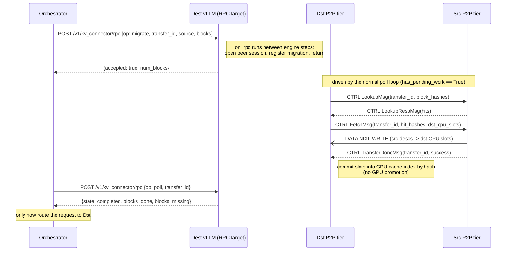

# RFC: Proactive P2P KV-Cache Migration API

*Builds on [RFC #51639 — Generic Control RPC for KV Connectors](https://github.com/vllm-project/vllm/issues/51639).*

## Summary

Expose an orchestrator-facing API to **proactively migrate a set of KV blocks
from one vLLM instance to another**, off any request's critical path. The API
is carried over the generic KV-connector control RPC from #51639
(`POST /v1/kv_connector/rpc`, opaque `bytes -> bytes`), and is implemented on
top of the existing **P2P secondary tier** (`P2PSecondaryTierManager`) without
changing its wire protocol or data plane.

A migration replicates blocks into the destination's **CPU KV cache only**. GPU
promotion happens later, on demand, through the destination's normal
lookup/promotion path when a request is finally routed there — so the remote
transfer cost is paid ahead of time and removed from time-to-first-token.

## Motivation

Today P2P KV transfer is **reactive and request-scoped**: a consumer request
carrying `remote_prefiller` / `remote_kv_source` in `kv_transfer_params`
discovers it needs blocks, looks them up on a peer, and only then fetches them.
The transfer sits on the request's critical path, so its latency is paid in
full at serving time. Peer selection is entirely external — a proxy injects
`remote_host` / `remote_port` / `kv_request_id` per request — and nothing can
move KV between two instances *before* a request arrives.

Two capabilities are missing:

1. **Prefetch / cache warming.** An orchestrator that knows a request will land
   on instance *D* wants to stage the relevant KV onto *D* in advance, so the
   request hits a warm cache instead of paying for a remote pull or a recompute.
2. **KV-aware load balancing.** Because the destination is chosen explicitly,
   the same primitive lets an orchestrator *place* KV on whichever instance it
   decides should serve — a building block for KV-aware routing and rebalancing.

Both need a control surface that is (a) triggered by the orchestrator, not by a
scheduled request, (b) asynchronous with a status handle, and (c) lands blocks
in CPU without forcing GPU residency. #51639 gives us the transport for
orchestrator→connector control; this RFC defines the payload and semantics that
turn it into a migration primitive.

## Design overview

### Direction: destination-pull

The RPC target is the **destination** instance, which *pulls* from the source.
This is deliberate: the existing P2P data plane is **receiver-driven** — the
consumer sends a `FetchMsg` listing the block keys and the *remote block
indexes* (slots in its own buffer) where it wants data written, and the producer
RDMA-`WRITE`s into them. The destination is therefore the natural point of
control: it allocates the landing slots, drives the transfer, and observes
completion. A source-push model would require a new protocol for the destination
to advertise slot addresses first; destination-pull reuses the handshake we
already have.

Concretely, a migration is a **headless (request-less) symmetric-P2P consumer
transaction**: the same `LookupMsg` → `FetchMsg` → `TransferDoneMsg` flow that a
symmetric-P2P *request* uses today, but not attached to any `Request` and
terminating in the CPU tier instead of promoting to GPU.

### Block identity

Blocks are named by **content hash** (the `OffloadKey` space used throughout the
offloading subsystem — chained from `PYTHONHASHSEED`, which peers already must
agree on). This is the same identity the reactive path matches on, so a
migrated block is indistinguishable from a natively-cached one and a later
request's lookup hits it transparently. The orchestrator obtains the hashes from
the source (e.g. via KV-cache events, or by asking the source which blocks it
holds for a known prefix — see Open Questions).

### Flow



The source needs no per-migration RPC: its P2P **server role** already answers
inbound `LookupMsg` against its own tiering manager and pins hits for the fetch
window (`serve_external_requests(parent)` → `create_store_job`). A migration
looks to the source exactly like any other symmetric-P2P consumer.

## The API (payload schema)

The RPC body is an opaque, connector-defined blob per #51639. The P2P connector
defines a small msgpack envelope. Byte fields (`blocks`) use msgpack `bin`; no
base64.

```jsonc
// envelope
{ "v": 1, "op": "migrate" | "poll" | "cancel", ... }
```

### `migrate` — submit (→ destination)

```jsonc
{
  "v": 1,
  "op": "migrate",
  "transfer_id": "orch-supplied-unique-string",
  "source": { "host": "10.0.0.5", "port": 5710 },   // src P2P side-channel identity
  "blocks":  [ b"<hash>", ... ]                      // OffloadKey bytes
}
```

Response:

```jsonc
{ "transfer_id": "...", "accepted": true,  "num_blocks": 128 }
// or
{ "transfer_id": "...", "accepted": false, "error": "insufficient_capacity" }
```

`num_blocks` is the number of **distinct** blocks accepted; duplicate hashes are
collapsed so `blocks_total` always reconciles against done/missing/failed.
Rejections are `no_blocks`, `duplicate_transfer_id`, `too_many_migrations`
(more than `_MAX_ACTIVE_MIGRATIONS` already in flight), `insufficient_capacity`
(more blocks than the destination CPU tier could hold even after eviction),
`bad_source`, `bad_blocks`, and `too_many_blocks`.

`transfer_id` is **allocated by the orchestrator**, mirroring today's
`pd_req_id` / `kv_request_id` convention. This keeps `poll` idempotent and lets
the orchestrator correlate without a returned-handle race. It is bounded to
`MAX_TRANSFER_ID_LEN` characters of `[A-Za-z0-9._:-]` since it goes on the wire
verbatim as the `kv_request_id`. Submit is **non-blocking**: it checks capacity,
registers the migration, and returns; the `LookupMsg`/`FetchMsg` are sent on the
next poll sweep.

### `poll` — status (→ destination)

```jsonc
{ "v": 1, "op": "poll", "transfer_id": "..." }
```

Response:

```jsonc
{
  "transfer_id": "...",
  "state": "running" | "completed" | "failed" | "cancelled" | "unknown",
  "blocks_total":       128,
  "blocks_done":        128,
  "blocks_missing":       0,   // source did not hold these hashes
  "blocks_failed":        0,   // transfer error, timeout, or no room
  "blocks_no_capacity":   0,   // subset of blocks_failed: no room locally
  "error": null                // short reason when state is failed|cancelled
}
```

`completed` means **every** requested block is resident and indexed in the
destination CPU cache; the orchestrator may now route the request. A clean
source miss (`blocks_missing`) is the only shortfall that still reports
`completed` — the peer simply does not hold those hashes, and no amount of
waiting changes that.

Anything else is `failed`, with `error` set to `timeout` (probes or transfers
unresolved past the deadline — we never learned whether the peer had them),
`insufficient_capacity` (a tier held the block but the CPU tier could not make
room), or `transfer_failed`. This distinction matters: reporting a timed-out or
capacity-starved migration as `completed` would send the orchestrator to a cold
cache believing it was warm.

`cancelled` is returned for a migration the orchestrator aborted. `unknown` is
returned for a `transfer_id` the destination has never seen or has already
reaped.

### `cancel` — optional (→ destination)

```jsonc
{ "v": 1, "op": "cancel", "transfer_id": "..." }
```

Aborts in-flight transfers (`AbortFetchMsg` + `DataTransport.cancel`) and frees
reserved CPU slots. Response: `{ "transfer_id": "...", "cancelled": true }`, or
`cancelled: false` for an id that is unknown or already terminal.

Freeing the slots is not automatic: the aborted fetch can no longer be acked by
the peer, so `ClientRole.finish` hands each aborted load back and the P2P tier
reports it as a failed job. That is what lets the tiering manager pop the
promotion and release the CPU blocks it had reserved; without it they stay
write-pending forever and the next `reset_cache()` trips its assertions.

## Transport & call chain

Reuses #51639 end to end; the migration payload is just what flows through it.

```text
POST /v1/kv_connector/rpc (migrate|poll|cancel bytes)
  -> EngineClient.invoke_kv_connector(payload)              # AsyncLLM
  -> EngineCore.invoke_kv_connector(payload)                # busy-loop thread
  -> Scheduler.invoke_kv_connector(payload)                 # guards on self.connector
  -> OffloadingConnector.on_rpc(payload)                    # delegate to scheduler side
       -> OffloadingConnectorScheduler.on_rpc(payload)      # decode envelope, dispatch
       -> TieringOffloadingManager.{submit,poll,cancel}_migration(...)
  <- bytes (msgpack response) | None (manager can't migrate -> HTTP 501)
```

`on_rpc` runs synchronously in the EngineCore busy loop between model steps, so
every handler is **non-blocking**: `migrate` opens the peer session + registers
state, `poll`/`cancel` read/flip registry state. The transfer itself advances on
the scheduler thread via the existing per-step `on_schedule_end()` sweep.

`TieringOffloadingManager.has_pending_work()` reports a non-terminal migration
as pending work, so `OffloadingConnectorScheduler.has_pending_push_work()` stays
`True` and the engine keeps stepping with or without request traffic. (The P2P
tier also returns `True` unconditionally today, which would mask a gap here; the
migration registry states the requirement itself rather than relying on that.)

Because the sweep runs inside the scheduler step, it is budgeted: at most
`_MIGRATION_KEYS_PER_STEP` keys are advanced per step across all migrations,
with a rotating start so a large prefetch cannot starve a later one. A migration
of many thousands of blocks therefore costs many cheap steps rather than one
long stall — otherwise "off the critical path" would be false for exactly the
requests the prefetch is meant to help.

## New / changed surfaces

**Connector hook (from #51639):**
`KVConnectorBase_V1.on_rpc(payload: bytes) -> bytes | None` (default `None`).
`OffloadingConnector.on_rpc` delegates to `OffloadingConnectorScheduler.on_rpc`,
which decodes the envelope and dispatches. It returns `None` (→ HTTP 501) unless
the configured manager is a `TieringOffloadingManager` with at least one
secondary tier — i.e. the connector genuinely can migrate.

**Migration methods live on `TieringOffloadingManager`** (not on the P2P tier):

```python
def submit_migration(self, transfer_id: str, host: str, port: int,
                     keys: Sequence[OffloadKey]) -> tuple[bool, int, str | None]
def poll_migration(self, transfer_id: str) -> dict | None   # None => unknown
def cancel_migration(self, transfer_id: str) -> bool
```

The manager keeps a `dict[transfer_id, _MigrationState]` registry and drives it
once per step from `_drive_migrations()` (called inside `on_schedule_end`).
**The P2P tier is unchanged**: a migration is just a synthetic, request-less
`remote_kv_source` transaction — `submit_migration` builds a `ReqContext`
carrying `{remote_kv_source: {remote_host, remote_port, kv_request_id}}` (the
`transfer_id` doubles as the wire `kv_request_id`) and calls the manager's normal
`on_new_request(ctx)`, which opens the peer session and caches the P2P routing
state exactly as a real consumer request would.

**No net-new primary-tier op — the promotion path already lands blocks in CPU.**
The RFC originally posited a "request-less reserve + commit-by-hash" primitive;
reading the code shows it already exists as the tiering manager's *promotion*
path, and a migration reuses it verbatim by driving each key through the
per-step lookup → promotion machinery, then simply **never pulling to GPU**:

1. `lookup(key, ctx)` (generic fan-out) — the `remote_kv_source` ctx makes the
   P2P tier probe/`FetchMsg` the named peer; if a *local* tier already holds the
   block it is promoted from there instead (still lands in CPU). `RETRY` while
   the peer probe is outstanding; `HIT` starts a promotion.
2. `_initiate_promotion()` → `primary_tier.prepare_write([key])` allocates a CPU
   slot (ref_cnt = -1, in-flight); `_flush_pending_promotions()` →
   `tier.submit_load(job)` issues the `FetchMsg` into that slot.
3. `_complete_promotion()` → `primary_tier.complete_write(keys, ctx, True)`
   **commits** the block into the CPU cache index by hash (ref_cnt -1 → 0) — a
   normal, evictable entry that a later request's `lookup()` will hit and pull to
   GPU. Because a migration never calls `prepare_load`, the blocks stop at CPU.

A per-key state machine (`probe → promoting → done | missing | failed`, with a
deadline backstop) never re-probes a resolved key, so a source miss cannot loop.
`poll` reads the registry; `cancel`/completion call the manager's ordinary
`on_request_finished(ctx)`, which finalizes immediately (no primary stores were
issued) and tears down the peer session state for the id. Terminal migrations
are retained for a TTL so `poll` can report the outcome, then reaped.

**No source-side changes** are required: the source sees an ordinary
symmetric-P2P consumer.

## Error model

Following #51639's HTTP mapping, with a connector-level split between *expected*
and *unexpected* failures:

- **Expected conditions** (unknown `transfer_id`, `insufficient_capacity`,
  unreachable `source`, malformed envelope) are reported *inside* the response
  payload (`accepted: false` / `state: failed|unknown`) with **HTTP 200**. The
  orchestrator handles these as data, not exceptions.
- **Truly unexpected** errors let the handler raise → **HTTP 500** (#51639 never
  swallows exceptions).
- **No migration-capable tier configured** → `on_rpc` returns `None` →
  **HTTP 501**. The gate is `SecondaryTierManager.supports_migration`, which
  only the P2P tier sets: a local or shared store has no peer to pull from, so
  accepting a migrate against one would report `completed` for something that
  was never a migration.
- **`data_parallel_size > 1`** → refused in-payload with
  `unsupported_topology`. The control RPC carries no DP-rank target: the
  engine-core client either broadcasts it to every rank or picks one
  arbitrarily, and each rank owns a separate CPU cache, so the blocks cannot be
  aimed at the rank that will serve the request.
- **No connector at all** → **HTTP 404** (detected by #51639 before dispatch).

## MultiConnector

Inherits #51639's "try-each / first-non-`None`" dispatch. When `OffloadingConnector`
is one child under a `MultiConnector`, the migration payload reaches it as long
as it is the only child implementing `on_rpc` (the documented #51639 limitation);
addressed routing among multiple RPC-capable children is future work.

## Security considerations

- Same trust boundary as #51639: the control endpoint hands attacker-controllable
  bytes to connector code and must sit behind the operator's boundary per
  `docs/usage/security.md`.
- **Cross-instance read.** A `migrate` lets the caller pull any block the source
  currently caches, addressed by content hash. Hashes require knowing the
  content (preimage resistance) so this is bounded, but in a multi-tenant
  deployment where one source caches multiple tenants' KV it is a potential
  cross-tenant read. Mitigations (out of scope for v1, noted as future work):
  per-migration authorization, tenant/namespace scoping of the hash space.
- **Payload bounds.** Cap `len(blocks)` per `migrate` and validate the envelope
  before touching the tier; vLLM performs no schema validation for opaque
  payloads by design, so the connector must bound its own input.

## Drawbacks

- Adds a stateful, orchestrator-driven control path to a subsystem that was
  previously request-driven only; introduces a migration registry with its own
  TTL/reaping lifecycle.
- The single net-new "request-less CPU landing" op touches the primary-tier
  allocator, which is otherwise only exercised on the promotion path.
- Like all `on_rpc` handlers, migration bookkeeping runs in the latency-sensitive
  EngineCore thread; it must stay O(#blocks) bookkeeping only.

## Alternatives

- **Source-push (RPC the source).** Source initiates the WRITE. Rejected for v1:
  the data plane is receiver-driven, so the destination would first have to
  advertise landing-slot addresses — a new protocol — for no reuse benefit over
  destination-pull.
- **Two-phase (pin-then-pull).** An extra `pin` RPC to the source guarantees the
  blocks survive eviction between the orchestrator's decision and the fetch. Not
  required for correctness (the server pins hits for the fetch window), so
  offered as an optional hardening, not the base design.
- **Per-operation typed endpoints** (a dedicated `/migrate` route with a typed
  body) instead of the opaque `on_rpc` envelope: safer/introspectable but
  requires core changes per operation and forks from #51639's model.
- **Promote-to-GPU variant.** A `migrate` that also warms GPU. Rejected for v1:
  the point is to stay off the critical path; GPU promotion should remain
  demand-driven via the normal request path.

## Open questions

1. **Direction.** Confirm destination-pull for v1 (vs source-push or two-phase
   pin+pull).
2. **Block addressing.** Content hash (v1) vs typed session coordinates
   (RFC #48501) vs token-ids resolved to hashes at the destination. How does the
   orchestrator discover the hashes to migrate?
3. **Completion signaling.** Poll (v1, fits #51639's request/response shape) vs a
   push notification / event stream to the orchestrator (future).
4. **Backpressure.** Max concurrent migrations, CPU-capacity admission policy,
   and eviction interaction when migrated blocks compete with live requests.
5. **Registry lifetime.** TTL for completed/failed `transfer_id`s before `poll`
   returns `unknown`.

## Related work

- **RFC #51639 — Generic Control RPC for KV Connectors.** Provides the transport
  this API rides on. This RFC is the first concrete consumer of `on_rpc`.
- **RFC #48501 — Session-centric KV-cache orchestration.** Complementary: its
  typed session coordinates are a candidate replacement for content-hash
  addressing (Open Question 2).
</content>

</invoke>
